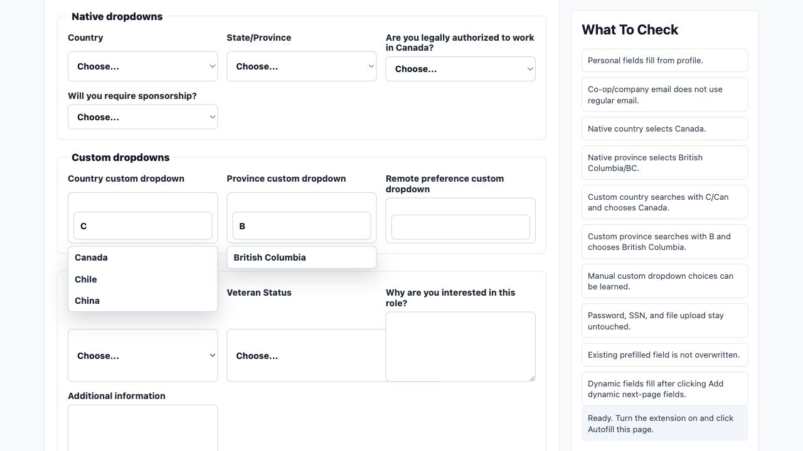

# Job Autofill Copilot

Job Autofill Copilot is a Chrome extension that helps you fill job applications faster while keeping you in control. You save your reusable information once, turn the extension on, and it fills matching fields as you move through application pages.

It is local-first:

- Your saved profile stays in Chrome extension storage on your own device.
- It does not submit applications or click Next for you.
- You can review and correct anything before sending an application.



## What It Can Do

- Fill common profile fields such as name, phone, LinkedIn, address, and work-authorization answers.
- Keep personal email, co-op / school email, and work / company email separate.
- Handle native dropdowns and custom dropdowns, including Canada and British Columbia.
- Learn repeated answers from manual selections, such as "Where did you hear about this job?"
- Re-scan newly loaded fields after you move to the next application page.
- Overwrite existing field values from your saved profile so old or incorrect autofill does not stay behind.

## What It Will Not Do

- It will not click Submit or Next for you.
- It will not fill passwords, SSNs, credit-card fields, bank details, or similar high-risk fields.
- It cannot upload resume files for you because browsers block extensions from filling file inputs automatically.
- Learned answers never override values you explicitly saved in your profile.

## Install In Chrome

1. Download this repository as a ZIP from GitHub, or clone it with Git:

   ```bash
   git clone https://github.com/pritam2003/autofill.git
   ```

2. If you downloaded a ZIP, unzip it first.
3. Open Chrome and go to `chrome://extensions`.
4. Turn on **Developer mode** in the top-right corner.
5. Click **Load unpacked**.
6. Select the project folder named `autofill`.
7. Open the extension, choose **Profile and memory**, and enter your own details.
8. Turn the extension on from the popup.

## Use It

1. Open a job application page.
2. Make sure the extension is turned on.
3. The extension fills matching saved answers automatically.
4. Review the form, correct anything if needed, and continue the application yourself.

If a dropdown behaves strangely, use **Pause this page** from the popup or floating panel, fix the field manually, and continue.

## How Learning Works

- Saved profile answers always win.
- Learned answers are used only when a field does not already have a saved profile value.
- If you manually choose a repeated answer such as `LinkedIn` for "Where did you hear about this job?", the extension can remember that answer for future applications.
- If a saved profile value is wrong, change it from **Profile and memory** instead of relying on a manual correction.

## Test It Before Using It On Real Applications

This repository includes two test pages:

- [`demo/job-application.html`](demo/job-application.html) for a simple example form.
- [`demo/test-lab.html`](demo/test-lab.html) for edge cases such as separate email types, native dropdowns, custom dropdowns, dynamic next-page fields, and blocked unsafe fields.

To run the included test pages:

1. Open a terminal in the project folder.
2. Start a local server:

   ```bash
   python3 -m http.server 8765
   ```

3. Open one of these pages in Chrome:

   - [http://127.0.0.1:8765/demo/job-application.html](http://127.0.0.1:8765/demo/job-application.html)
   - [http://127.0.0.1:8765/demo/test-lab.html](http://127.0.0.1:8765/demo/test-lab.html)

4. Turn on the extension and try filling the page.

If you prefer opening the HTML files directly instead of using a local server, enable **Allow access to file URLs** for this extension in `chrome://extensions`.

## Notes For Contributors

- Main extension code lives in [`src/`](src).
- Matcher tests live in [`test/field-engine.test.cjs`](test/field-engine.test.cjs).
- Run tests with:

  ```bash
  npm test
  ```

## License

This project is open source under the MIT License. See [`LICENSE`](LICENSE).
